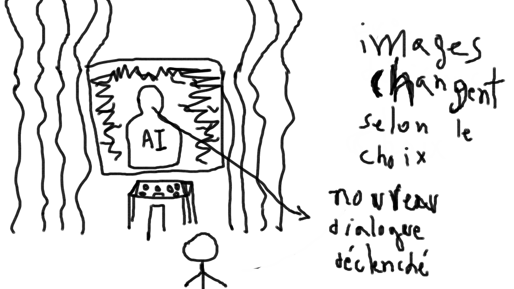

# Idée de projet multimédia
## Le Génie
Présentation par Daniel Dezemma

### Idée et Concept
 J'aimerais réaliser un projet inspiré de quelques un de mes oeuvres préférées portant sur la dystopie et l'aspect futuristique. Je veux créer un environnement qui rappelle les ambiances de Westworld, Black Mirror, ou Blade Runner, des univers qui traitent de l’intelligence artificielle, de la technologie, et de la condition humaine. Le projet "Le Génie" est une installation interactive où un personnage en 3D réagit à des choix (voeux) faits par les utilisateurs via une tablette ou ordinateur (peut-être mobile via code QR) sur une page web interactive. 
 
 Chaque choix entraîne une animation et un dialogue différent du Génie. Je souhaite ajouter un aspect philosophique à l'oeuvre en explorant des dilemmes moraux et les conséquences des voeux en confrontant l'utilisateur à des choix signicatifs. Le projet interroge le pouvoir des désirs et de la complexité de leurs répercussions. Je veux également proposer une expérience interactive immersive en renforcant la sensationde pouvoir et de responsabilité entre les mains de l'utilisateur à chaque prise de décision.

L'utilisateur accède à une page web interactive où il fait des choix parmi une sélection limitée de vœux. Ces choix influencent directement l'animation et la narration du personnage en temps réel.

### Scénario
Scénario interactif :
Le visiteur se trouve face à plusieurs options de vœux ex:
-Souhaiter la paix mondiale. 
-Souhaiter la mort d'une célébrité ou politicien controversé (comme Kanye West ou Donald Trump).
-Souhaiter devenir riche/milliardaire.
Chaque vœu déclenche une animation et un dialogue uniques du Génie, avec des réponses émotionnelles et des conséquences narratives qui varient.

-Schéma de l'interactivité :

-Développement narratif :
Le Génie présente une façade bienveillante, mais chaque vœu révèle une facette différente de sa personnalité, plongeant le visiteur dans une réflexion profonde sur ses désirs et les conséquences de ses actions.

### Ambiance
-Inspiration pour l'ambiance :

-Palette de couleur :

Il y aura un contraste entre des couleurs vives néons qui rappelle un monde virtuelle/techno et des couleurs plus froids et métalliques qui rappelles un monde dystopique.

Planche d’ambiances sonores :
Utilisation de musiques synthwave et de sons industriels pour renforcer l’aspect futuriste et dystopique.
Des échantillons sonores tels que des bruits métalliques, des échos, et des tonalités électroniques créent un environnement sonore immersif.
- [ambiance-sonore](https://www.youtube.com/watch?v=tGIcpabjCiQ)

### Références artistiques

-Visuelles :

Films : Blade Runner 2049, Westworld, Black Mirror.

Œuvres d’art : Les œuvres de Syd Mead pour les concepts futuristes.

-Environnements : Cités cyberpunk, désert numérique, environnements urbains post-apocalyptiques.

-Sonores :

Musiques : Compositeurs comme Hans Zimmer pour des sons électroniques/synthwaves et orchestraux combinés.

Soundscapes de Blade Runner et Westworld pour une atmosphère immersive et intense.

### Technologies

-Les technologies utilisées :
Vidéo : Projection vidéo haute résolution pour le personnage 3D.
Audio : Systèmes de diffusion sonore directionnelle pour accompagner les animations du Génie.
Lumières : Utilisation de LEDs et de lumières d'ambiance pour accentuer le côté futuriste.
Capteurs : Capteurs de mouvement ou tactiles pour capter les interactions du visiteur avec la tablette.

-Logiciels : Logiciels d’animation 3D (comme Unity ou Unreal Engine) pour l’intégration du personnage et l’interaction en temps réel.
Unity 3D : Pour la gestion des animations en temps réel du Génie.
WebSockets : Pour la communication instantanée entre la tablette et le moteur d’animation du personnage. Utilisation de WebSockets pour la communication bidirectionnelle entre la page web de l’utilisateur et le serveur qui gère les animations et dialogues du Génie.
Maya : Pour la création du personnage 3D. 
Touch Designer : Pour animer l'ambiance interactive et synchroniser l'audio et vidéo.

### Scénarimage :

### Synoptique : 

- A représente la tablette/ordinateur, où l’utilisateur interagit en envoyant une demande.
- B est le serveur web qui gère les requêtes et les envoie à ChatGPT.
- C est l'API ChatGPT, qui génère une réponse en texte.
- D est la synthèse vocale, convertissant le texte en audio.
- E représente le moteur d'animation 3D qui synchronise l'animation avec l'audio.
- F est le projecteur vidéo qui affiche l'image du Génie.
- G est le système audio, diffusant la voix du Génie pour l'immersion sonore.

### Sources : 
- [Syd Mead](https://sydmead.com/)
- [ChatGPT](https://chatgpt.com/)
